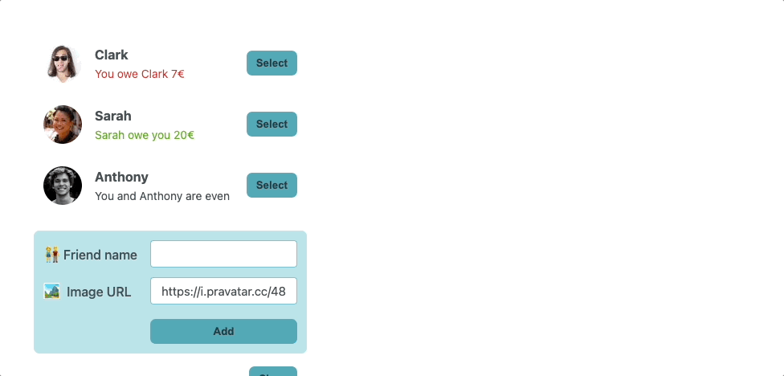

# Who-pays-Meal-App
## Description
A beginner React app is created for studying states. Project idea is taken from Udemy Ultimate-React-Course of Jonas Schmedtmann.

### Project Outcome
https://who-pays-meal-app.vercel.app

